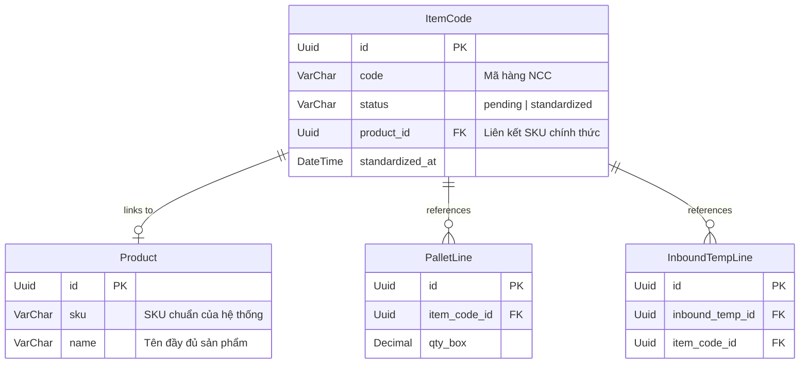
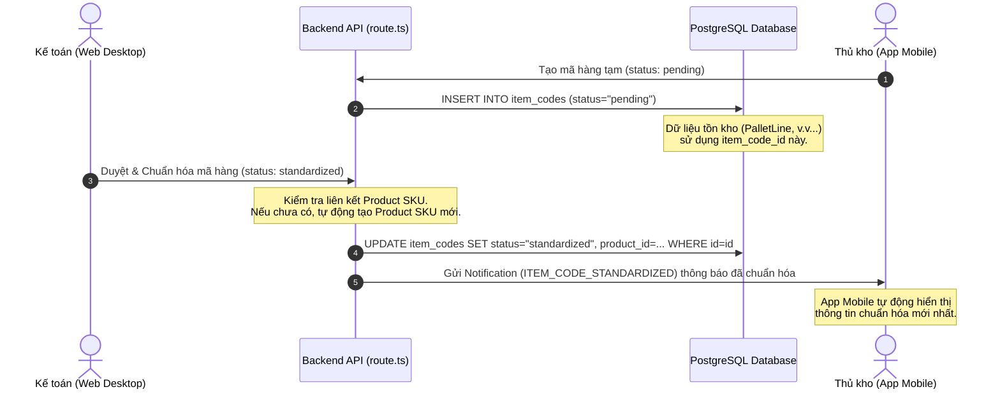

# Báo cáo Luồng Xử lý & Chuẩn hóa Mã hàng tạm / Phiếu tạm (WMS Vĩnh Giang)

Báo cáo này phân tích chi tiết cơ chế hoạt động của hệ thống WMS Vĩnh Giang liên quan đến luồng **Mã hàng tạm** (do Thủ kho tạo nhanh trên Mobile) và quy trình **Chuẩn hóa** (do Kế toán thực hiện trên Desktop). Đồng thời, tài liệu làm rõ lý do tại sao hệ thống không cần thiết lập cơ chế đồng bộ song song phức tạp giữa hai trạng thái tạm và chuẩn hóa mà vẫn đảm bảo tính toàn vẹn dữ liệu tuyệt đối.

---

## 1. Phân biệt Hai Khái niệm "Tạm" (Pending) trong Hệ thống

Trong hệ thống WMS Vĩnh Giang, có 2 đối tượng riêng biệt mang trạng thái "tạm" (chờ xử lý) phát sinh từ thực tế vận hành kho:

1. **Mã hàng tạm (Item Code - Pending)**:
   - Phát sinh khi Thủ kho nhận hàng có mã vạch/mã hàng lạ chưa có sẵn trong danh mục hệ thống. Thủ kho sẽ tạo nhanh mã tạm ngay trên app di động để dán lên pallet và tiến hành xếp hàng (Put-away).
   - Biểu diễn trong DB: Bảng `ItemCode` có trạng thái `status = "pending"`.
2. **Phiếu tồn tạm (Inbound Temp - Pending)**:
   - Phát sinh khi xe chở hàng đến kho đột xuất mà chưa có Phiếu yêu cầu nhập kho (PNK) do kế toán lập trước. Thủ kho tiếp nhận thực tế, tạo phiếu tạm để ghi nhận số lượng trước khi cho dỡ hàng.
   - Biểu diễn trong DB: Bảng `InboundTemp` có trạng thái `status = "PENDING"`.

---

## 2. Thiết kế Kiến trúc Cơ sở Dữ liệu (Prisma Schema)

Hệ thống thiết kế cơ sở dữ liệu quan hệ chặt chẽ giúp tự động liên kết dữ liệu mà không cần đồng bộ thủ công. Dưới đây là các bảng liên quan chính:

---

## 3. Quy trình chuẩn hóa mã hàng tạm & Cơ chế cập nhật tại chỗ (In-place Update)

### 3.1. Luồng hoạt động chi tiết

Khi Kế toán tiến hành chuẩn hóa danh mục mã hàng tại màn hình `/wms/item-codes`:

### 3.2. Tại sao không cần cơ chế "đồng bộ song song"?

Sự lo ngại về việc **không đồng bộ lên mã hàng tạm** khi chuẩn hóa được giải quyết triệt để nhờ **Cơ chế cập nhật tại chỗ (In-place Update)**:

> [!IMPORTANT]
> **Không tạo bản ghi mới (No Duplication):**
> Khi Kế toán chuẩn hóa mã hàng tạm, Backend API tại [src/app/api/item-codes/[id]/route.ts](file:///d:/wms-vinhgiang_repo/src/app/api/item-codes/%5Bid%5D/route.ts#L129-L199) thực hiện câu lệnh `UPDATE` trực tiếp trên bản ghi `ItemCode` hiện tại thông qua `id` thay vì tạo mới một bản ghi sản phẩm riêng biệt.

Điều này mang lại những ưu điểm thiết kế lớn:
- **Tính nhất quán tuyệt đối (Referential Integrity):** Vì `id` của mã hàng không bao giờ thay đổi, tất cả các Pallet (`PalletLine`), Phiếu nhập đột xuất (`InboundTempLine`), hay Phiếu kiểm kê (`StocktakeCount`) đang tham chiếu đến `item_code_id` này **sẽ tự động liên kết với thông tin đã chuẩn hóa** ngay lập tức.
- **Không xảy ra độ trễ (Zero Lag):** Không cần bất kỳ trigger hoặc hàng đợi đồng bộ nào chạy ngầm. Khi câu lệnh SQL `UPDATE` hoàn tất, toàn bộ hệ thống (Web và Mobile) đều lập tức truy vấn ra trạng thái mới.
- **Tự động liên kết SKU:** Nếu Kế toán chọn một sản phẩm (Product) có sẵn để map, `item_code.product_id` được gán vào. Nếu tạo mới Product, hệ thống cũng ghi nhận ID của Product mới vào bảng `item_codes`.

---

## 4. Quy trình chuẩn hóa Phiếu tồn tạm (Inbound Temp)

Tương tự mã hàng, đối với **Phiếu tồn tạm** (`InboundTemp`), khi Kế toán chuẩn hóa tại [src/app/api/inbound-temp/[id]/standardize/route.ts](file:///d:/wms-vinhgiang_repo/src/app/api/inbound-temp/%5Bid%5D/standardize/route.ts), hệ thống hỗ trợ 2 chế độ xử lý tùy chọn:

1. **Chế độ Tạo mới (mode = "create"):**
   - Tạo một Phiếu nhập kho chính thức (`InboundRequest` có trạng thái `DRAFT`).
   - Sao chép toàn bộ các dòng hàng từ phiếu tạm sang phiếu chính thức.
   - Cập nhật trạng thái phiếu tạm thành `STANDARDIZED` và liên kết `inbound_request_id` để làm vết tham chiếu ngược.
2. **Chế độ Liên kết (mode = "link"):**
   - Đẩy toàn bộ các dòng hàng của phiếu tạm gộp chung vào một Phiếu yêu cầu nhập kho đang mở sẵn.
   - Cập nhật trạng thái phiếu tạm thành `STANDARDIZED`.

Nhờ cơ chế này, tồn kho thực tế do Thủ kho quét nhận ban đầu được chuyển đổi sang tồn kho chính thức mà không bị mất dấu vết gốc.

---

## 5. Kết luận

Hệ thống WMS Vĩnh Giang giải quyết bài toán mã tạm bằng giải pháp kiến trúc cơ sở dữ liệu quan hệ:
- **Mã hàng tạm** và **Mã hàng chuẩn** thực chất **chung một bảng dữ liệu** (`item_codes`) và chỉ khác nhau về trạng thái `status`.
- Do đó, hành động chuẩn hóa của Kế toán là **cập nhật trạng thái tại chỗ**, giúp dữ liệu lập tức nhất quán ở tất cả các khâu mà không cần đồng bộ.
- Điều này loại bỏ hoàn toàn rủi ro sai lệch số liệu hoặc trùng lặp mã hàng giữa Kế toán và Thủ kho.
