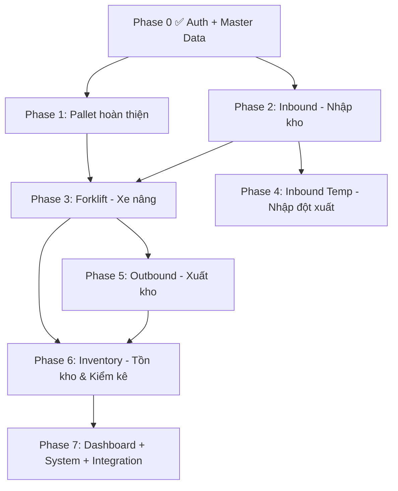

# 🗺️ LỘ TRÌNH TRIỂN KHAI TOÀN BỘ 56 USE CASE
## Hệ Thống WMS Vĩnh Giang · v3.0

---

## TỔNG QUAN TIẾN ĐỘ

```
██████░░░░░░░░░░░░░░░░░░░░░░░░  21% (12/56 UC)

✅ Đã hoàn thành:  12 UC (Auth 3 + Master Data 6 + Pallet 2 + System 1*)
⬜ Còn lại:         44 UC
📅 Ước tính:        25-30 ngày làm việc (tùy mức độ phức tạp)
```

> *UC-SYS-05 Profile = trang Đổi mật khẩu đã có

---

## SƠ ĐỒ PHỤ THUỘC GIỮA CÁC MODULE



**Quy tắc:** Mỗi Phase chỉ bắt đầu khi Phase phụ thuộc đã xong. Trong cùng Phase, các UC có thể làm song song.

---

## PHASE 0: NỀN TẢNG ✅ ĐÃ HOÀN THÀNH

| # | Mã UC | Tên | Trạng thái | Test |
|---|-------|-----|------------|------|
| 1 | UC-AUTH-01 | Đăng nhập | ✅ Done | ✅ |
| 2 | UC-AUTH-03 | Đổi mật khẩu | ✅ Done | ✅ |
| 3 | UC-AUTH-04 | Quên mật khẩu | ✅ Done | ✅ |
| 4 | UC-MD-01 | Khai báo sản phẩm | ✅ Done | ✅ |
| 5 | UC-MD-02 | Quản lý Mã hàng | ✅ Done | ✅ |
| 6 | UC-MD-03 | Quản lý Nhóm hàng | ✅ Done | ✅ |
| 7 | UC-MD-04 | Quản lý Đơn vị tính | ✅ Done | ✅ |
| 8 | UC-MD-05 | Quản lý Vị trí kho | ✅ Done | ✅ |
| 9 | UC-MD-06 | Quản lý Nhà cung cấp | ✅ Done | ✅ 16/16 |
| 10 | UC-PAL-01 | Tạo pallet | ✅ Done | ✅ 14/14 |
| 11 | UC-PAL-02 | Cập nhật pallet (thêm hàng) | ✅ Done | ✅ 15/15 |
| 12 | UC-SYS-05 | Profile cá nhân | ✅ Done | ✅ |

---

## PHASE 1: PALLET HOÀN THIỆN (4 UC · ~4 ngày)

> **Mục tiêu:** Hoàn thiện vòng đời pallet: quét mã → xác nhận → sửa sau xác nhận → lịch sử.
> **Phụ thuộc:** Phase 0 ✅

| # | Mã UC | Tên | Ưu tiên | Ước tính | Chi tiết |
|---|-------|-----|---------|----------|---------|
| 13 | UC-PAL-03 | Quét mã hàng vào pallet | Must | 1 ngày | Tích hợp camera quét barcode/QR trên mobile (html5-qrcode lib). Khi quét → match mã hàng → điền form. Fallback: nhập thủ công, gợi ý tạo mã mới (UC-MD-02). |
| 14 | UC-PAL-04 | Xác nhận pallet | Must | 1 ngày | Nút "Xác nhận" trên trang chi tiết pallet. Kiểm tra ≥1 dòng hàng. Tính tổng tải trọng tự động. Chuyển status COUNTING → CONFIRMED. API: `POST /api/pallets/[id]/confirm`. |
| 15 | UC-PAL-05 | Sửa pallet sau xác nhận | Should | 1 ngày | "Yêu cầu sửa" (unlock) → nhập lý do bắt buộc → status CONFIRMED → COUNTING. Ghi audit log. API: `POST /api/pallets/[id]/unlock`. |
| 16 | UC-PAL-06 | Xem lịch sử pallet | Must | 1 ngày | Tab "Lịch sử" trên trang chi tiết: timeline trạng thái, ai làm, lúc nào. Bảng `pallet_history` hoặc dùng audit_log lọc theo pallet. |

### Files cần tạo/sửa Phase 1:
```
prisma/schema.prisma                    → Thêm PalletHistory model (tùy chọn)
src/app/api/pallets/[id]/confirm/route.ts  → POST xác nhận
src/app/api/pallets/[id]/unlock/route.ts   → POST unlock + audit
src/app/pallets/[id]/page.tsx            → Sửa: thêm nút Xác nhận, Unlock, tab Lịch sử
src/components/BarcodeScanner.tsx         → Component quét barcode (html5-qrcode)
```

### Điều kiện hoàn thành Phase 1:
- [ ] Quét mã thêm hàng vào pallet thành công
- [ ] Xác nhận pallet → status = CONFIRMED
- [ ] Unlock pallet → status = COUNTING + audit log
- [ ] Xem timeline lịch sử pallet

---

## PHASE 2: INBOUND — NHẬP KHO (6 UC · ~6 ngày)

> **Mục tiêu:** Quy trình nhập kho hoàn chỉnh: Kế toán lập phiếu → Thủ kho tiếp nhận → Đối chiếu → Chốt → Theo dõi.
> **Phụ thuộc:** Phase 0 ✅ (Master Data + Pallet)

| # | Mã UC | Tên | Ưu tiên | Ước tính | Chi tiết |
|---|-------|-----|---------|----------|---------|
| 17 | UC-IN-01 | Lập phiếu yêu cầu nhập | Must | 1.5 ngày | Kế toán tạo phiếu: chọn NCC, ngày dự kiến, thêm dòng hàng (mã, SL, Lô, HSD). Sinh mã PNK-YYYY-SSSS. Schema: `InboundRequest` + `InboundRequestLine`. |
| 18 | UC-IN-06 | Nhập phiếu từ Excel ★ | Must | 1.5 ngày | Upload Excel NCC → parse → match mã hàng (xanh/vàng) → tự tạo mã tạm cho hàng không khớp → tạo phiếu. Dùng `xlsx` lib. |
| 19 | UC-IN-02 | Tiếp nhận phiếu nhập | Must | 1 ngày | Thủ kho mở phiếu trên mobile → xem hàng dự kiến → nhập SL thực nhận từng dòng → ghi chú chênh lệch. |
| 20 | UC-IN-03 | Đối chiếu phiếu nhập | Must | 1 ngày | Kế toán trên PC: bảng so sánh dự kiến vs thực nhận → phê duyệt/điều chỉnh → ghi lý do chênh lệch. |
| 21 | UC-IN-04 | Chốt phiếu nhập | Must | 0.5 ngày | "Chốt phiếu" → cập nhật tồn kho → trạng thái "Hoàn tất". Cảnh báo nếu còn chênh lệch chưa xử lý. |
| 22 | UC-IN-05 | Theo dõi phiếu nhập | Must | 0.5 ngày | Trang danh sách phiếu + lọc NCC/thời gian/trạng thái + xem chi tiết. |

### Schema mới Phase 2:
```prisma
enum InboundStatus { DRAFT  PENDING  RECEIVING  RECONCILING  COMPLETED  CANCELLED }

model InboundRequest {
  id, code (PNK-YYYY-SSSS), supplier_id, expected_date, status,
  note, created_by, received_by, reconciled_by, completed_at,
  lines InboundRequestLine[], pallets Pallet[]
}

model InboundRequestLine {
  id, inbound_request_id, item_code_id,
  qty_expected, qty_received, qty_accepted,
  lot, expiry_date, note, discrepancy_note
}
```

### Điều kiện hoàn thành Phase 2:
- [ ] Tạo phiếu nhập từ form + từ Excel
- [ ] Thủ kho nhập SL thực nhận
- [ ] Bảng đối chiếu dự kiến vs thực nhận
- [ ] Chốt phiếu → cập nhật tồn kho
- [ ] Trang theo dõi phiếu + lọc

---

## PHASE 3: FORKLIFT — XE NÂNG (6 UC · ~5 ngày)

> **Mục tiêu:** Xe nâng xếp pallet vào vị trí, di chuyển, chuyển khu xuất, hoàn trả.
> **Phụ thuộc:** Phase 1 (Pallet xác nhận) + Phase 2 (Nhập kho)

| # | Mã UC | Tên | Ưu tiên | Ước tính | Chi tiết |
|---|-------|-----|---------|----------|---------|
| 23 | UC-FK-01 | DS pallet chờ xếp | Must | 0.5 ngày | Danh sách pallet status=CONFIRMED, sắp theo thời gian. |
| 24 | UC-FK-02 | Đưa pallet vào vị trí | Must | 1 ngày | Chọn pallet → quét QR vị trí → kiểm tra trống → "Đã xếp" → Pallet=IN_STORAGE, Location=OCCUPIED. Schema: `Movement` table. |
| 25 | UC-FK-03 | Chuyển vị trí pallet | Must | 1 ngày | Quét pallet → xác nhận vị trí cũ → quét vị trí mới → hoàn tất → cập nhật cả 2 vị trí. |
| 26 | UC-FK-04 | Chuyển sang khu chờ xuất (FEFO) | Must | 1 ngày | Gợi ý FEFO (HSD gần nhất trước). Cảnh báo: ≤7 ngày → 🔴, ≤30 ngày → 🟡. Pallet=IN_STAGING. |
| 27 | UC-FK-05 | Hoàn trả pallet (Audit) | Must | 1 ngày | Hoàn trả từ khu xuất → nhập lý do bắt buộc → sửa SL/Lô nếu cần → audit log bắt buộc. |
| 28 | UC-FK-06 | Lịch sử luân chuyển | Should | 0.5 ngày | Tìm theo pallet/mã hàng/vị trí → timeline di chuyển. Dùng bảng `Movement`. |

### Schema mới Phase 3:
```prisma
enum MovementType { PUT_AWAY  RELOCATE  STAGE_OUT  RETURN }

model Movement {
  id, pallet_id, movement_type,
  from_location_id, to_location_id,
  reason, performed_by, performed_at,
  audit_note
}
```

### Điều kiện hoàn thành Phase 3:
- [ ] Xe nâng xếp pallet → vị trí cập nhật
- [ ] Di chuyển pallet giữa các vị trí
- [ ] FEFO gợi ý đúng thứ tự HSD
- [ ] Hoàn trả + audit log
- [ ] Timeline lịch sử luân chuyển

---

## PHASE 4: INBOUND TEMP — NHẬP ĐỘT XUẤT (3 UC · ~2 ngày)

> **Mục tiêu:** Hàng về đột xuất không có phiếu → Thủ kho tạo phiếu tạm → Kế toán chuẩn hóa.
> **Phụ thuộc:** Phase 2 (Inbound)

| # | Mã UC | Tên | Ưu tiên | Ước tính | Chi tiết |
|---|-------|-----|---------|----------|---------|
| 29 | UC-INTMP-01 | Tạo phiếu tồn tạm (Mobile) | Must | 1 ngày | Form mobile: NCC, ghi chú, quét barcode → lưu phiếu tạm. Liên kết UC-MD-02 (tạo mã nhanh). |
| 30 | UC-INTMP-02 | Chuẩn hóa phiếu tạm (Desktop) | Must | 0.5 ngày | Kế toán xem "Phiếu tạm chờ" → đối chiếu mã → phê duyệt → chuyển thành phiếu nhập chính thức. |
| 31 | UC-INTMP-03 | Xem tồn tạm | Must | 0.5 ngày | Danh sách tồn tạm + tổng giá trị. |

### Schema mới Phase 4:
```prisma
enum InboundTempStatus { PENDING  STANDARDIZED  REJECTED }

model InboundTemp {
  id, code, supplier_id, note, status,
  created_by (Thủ kho), standardized_by (Kế toán),
  lines InboundTempLine[], pallets Pallet[]
}
```

---

## PHASE 5: OUTBOUND — XUẤT KHO (5 UC · ~4 ngày)

> **Mục tiêu:** Quản lý khu chờ xuất, cân lại tồn, báo cáo xuất, gợi ý nhập.
> **Phụ thuộc:** Phase 3 (Forklift — pallet đã ở khu chờ xuất)

| # | Mã UC | Tên | Ưu tiên | Ước tính | Chi tiết |
|---|-------|-----|---------|----------|---------|
| 32 | UC-OUT-01 | Xem khu chờ xuất | Must | 0.5 ngày | Danh sách pallet/hàng IN_STAGING: SL, HSD, thời gian vào. |
| 33 | UC-OUT-05 | Cân lại tồn khu chờ xuất ★ | Must | 1.5 ngày | Upload Excel SL đã xuất → so sánh tồn → xác nhận → trừ tồn. Đồng bộ UC-INV-01. |
| 34 | UC-OUT-02 | Báo cáo xuất tương đối | Must | 1 ngày | Tổng hợp SL xuất theo kỳ/mã hàng/NCC. Biểu đồ + xuất Excel. |
| 35 | UC-OUT-03 | Tốc độ luân chuyển | Should | 0.5 ngày | Turnover rate theo mã hàng/nhóm. Biểu đồ. |
| 36 | UC-OUT-04 | Gợi ý nhập hàng | Should | 0.5 ngày | Phân tích tồn hiện tại vs mức min → danh sách cần nhập + SL gợi ý. |

---

## PHASE 6: INVENTORY — TỒN KHO & KIỂM KÊ (9 UC · ~7 ngày)

> **Mục tiêu:** Xem tồn kho đa chiều + kiểm kê + xử lý chênh lệch + điều chỉnh tồn.
> **Phụ thuộc:** Phase 3 + Phase 5 (dữ liệu pallet đã vào kho + xuất kho)

| # | Mã UC | Tên | Ưu tiên | Ước tính | Chi tiết |
|---|-------|-----|---------|----------|---------|
| 37 | UC-INV-01 | Tồn kho theo mã hàng | Must | 1 ngày | Aggregate pallet_lines GROUP BY item_code: SL khả dụng, SL chờ, Tổng tồn, min/max. Cảnh báo HSD FEFO. |
| 38 | UC-INV-02 | Tồn kho theo vị trí | Must | 1 ngày | Sơ đồ lưới kho + màu sắc trạng thái. Click vị trí → xem pallet + hàng bên trong. |
| 39 | UC-INV-03 | Tồn kho theo pallet | Must | 0.5 ngày | Danh sách pallet IN_STORAGE/IN_STAGING + lọc + chi tiết. (Cơ bản đã có từ UC-PAL trang /pallets). |
| 40 | UC-INV-04 | Tồn kho theo lô/HSD (FEFO) | Must | 0.5 ngày | Phân bổ tồn theo lô + HSD. Sắp xếp FEFO. Cảnh báo ≤7/≤30 ngày. |
| 41 | UC-INV-05 | Cảnh báo HSD & tồn thấp | Must | 0.5 ngày | Cron/scheduled query: quét HSD ≤7/≤30 ngày + tồn < min → hiện Dashboard + email. |
| 42 | UC-INV-06 | Kiểm kê theo vị trí ★ | Must | 1 ngày | Tạo phiên kiểm kê → phân công vị trí → quét mã vị trí → đếm thực tế → gửi kết quả. Schema: `StocktakeSession`, `StocktakeCount`. |
| 43 | UC-INV-07 | Kiểm kê theo mã hàng ★ | Must | 0.5 ngày | Chọn mã hàng → liệt kê vị trí → đếm từng vị trí → tổng hợp. |
| 44 | UC-INV-08 | Xử lý chênh lệch ★ | Must | 0.5 ngày | Bảng: Tồn HT vs Thực đếm → phân loại dương/âm → điều tra → phê duyệt điều chỉnh hoặc kiểm lại. |
| 45 | UC-INV-09 | Phiếu điều chỉnh tồn ★ | Must | 0.5 ngày | Tạo phiếu từ chênh lệch → nhập lý do bắt buộc → Quản lý phê duyệt → cập nhật tồn + audit log. |

### Schema mới Phase 6:
```prisma
model StocktakeSession {
  id, code, type (BY_LOCATION | BY_ITEM), status (OPEN | COUNTING | RECONCILING | CLOSED),
  created_by, assigned_to[], started_at, completed_at,
  counts StocktakeCount[]
}

model StocktakeCount {
  session_id, location_id, item_code_id,
  system_qty, actual_qty, discrepancy, note,
  counted_by, counted_at
}

model AdjustmentVoucher {
  id, code, stocktake_session_id, reason (bắt buộc),
  status (PENDING | APPROVED | REJECTED),
  approved_by, approved_at, lines AdjustmentLine[]
}
```

---

## PHASE 7: DASHBOARD + SYSTEM + INTEGRATION (10 UC · ~6 ngày)

> **Mục tiêu:** Dashboard theo vai trò, quản trị hệ thống, tích hợp barcode/ảnh/Excel.
> **Phụ thuộc:** Phase 6 (cần dữ liệu tồn kho để hiển thị KPI)

| # | Mã UC | Tên | Ưu tiên | Ước tính | Chi tiết |
|---|-------|-----|---------|----------|---------|
| 46 | UC-DASH-01 | Dashboard theo vai trò | Must | 1.5 ngày | 5 giao diện: Kế toán (phiếu nhập/xuất), Thủ kho (pallet chờ), Xe nâng (việc cần làm), NKK (phiên kiểm), Quản lý (KPI tổng). |
| 47 | UC-DASH-02 | KPI tổng quan | Must | 1 ngày | Tổng tồn, Nhập/Xuất trong kỳ, % vị trí sử dụng, Hàng sắp hết HSD, Hiệu suất xe nâng. Biểu đồ Chart.js. |
| 48 | UC-AUTH-05 | Phân quyền RBAC | Must | 1 ngày | Ma trận 5 vai trò × N chức năng. Middleware kiểm tra quyền trên mọi API. |
| 49 | UC-SYS-01 | Cấu hình chung | Must | 0.5 ngày | Tên công ty, ngưỡng HSD, mức tồn min mặc định, múi giờ. |
| 50 | UC-SYS-02 | Cấu hình mail | Should | 0.5 ngày | SMTP server, port, tài khoản + test kết nối. Dùng Nodemailer. |
| 51 | UC-SYS-03 | Audit Log | Must | 0.5 ngày | Trang xem audit log: lọc người dùng/hành động/thời gian + xuất Excel. |
| 52 | UC-SYS-04 | Quản lý người dùng | Must | 0.5 ngày | CRUD user: tạo, sửa, gán vai trò, khóa/mở. Gửi email thông báo. |
| 53 | UC-INT-01 | Quét barcode/QR Code | Must | 0 ngày | **Tái sử dụng** BarcodeScanner component từ Phase 1 (UC-PAL-03). |
| 54 | UC-INT-02 | Chụp ảnh đính kèm | Should | 0.5 ngày | Upload ảnh vào phiếu nhập/xuất. Max 10 ảnh/phiếu, 5MB/ảnh. Dùng S3 hoặc local storage. |
| 55 | UC-INT-03 | Xuất Excel báo cáo | Should | 0.5 ngày | Component ExcelExport: chọn cột, phạm vi, định dạng .xlsx/.csv. Dùng `xlsx` lib. |

---

## TIMELINE TỔNG HỢP

```
PHASE 0  ████████████████████████████ DONE (12 UC) ✅
         Auth + Master Data + PAL-01/02

PHASE 1  ████░░░░ 4 ngày (4 UC)
         PAL-03 → PAL-04 → PAL-05 → PAL-06

PHASE 2  ██████░░░░░░ 6 ngày (6 UC)
         IN-01 → IN-06 → IN-02 → IN-03 → IN-04 → IN-05

PHASE 3  █████░░░░░ 5 ngày (6 UC)
         FK-01 → FK-02 → FK-03 → FK-04 → FK-05 → FK-06

PHASE 4  ██░░ 2 ngày (3 UC)
         INTMP-01 → INTMP-02 → INTMP-03

PHASE 5  ████░░░░ 4 ngày (5 UC)
         OUT-01 → OUT-05 → OUT-02 → OUT-03 → OUT-04

PHASE 6  ███████░░░░░░░ 7 ngày (9 UC)
         INV-01 → INV-02 → INV-03 → INV-04 → INV-05
         INV-06 → INV-07 → INV-08 → INV-09

PHASE 7  ██████░░░░░░ 6 ngày (10 UC)
         DASH-01/02 + AUTH-05 + SYS-01~04 + INT-01~03

TỔNG     ≈ 34 ngày làm việc (≈ 7 tuần)
```

---

## BẢNG TỔNG HỢP 56 UC — TRẠNG THÁI & ƯỚC TÍNH

| # | Phase | Mã UC | Tên | Must/Should | Ngày | Status |
|---|-------|-------|-----|-------------|------|--------|
| 1 | 0 | UC-AUTH-01 | Đăng nhập | Must | — | ✅ |
| 2 | 0 | UC-AUTH-03 | Đổi mật khẩu | Must | — | ✅ |
| 3 | 0 | UC-AUTH-04 | Quên mật khẩu | Must | — | ✅ |
| 4 | 0 | UC-MD-01 | Khai báo sản phẩm | Must | — | ✅ |
| 5 | 0 | UC-MD-02 | Quản lý Mã hàng | Must | — | ✅ |
| 6 | 0 | UC-MD-03 | Quản lý Nhóm hàng | Must | — | ✅ |
| 7 | 0 | UC-MD-04 | Quản lý Đơn vị tính | Must | — | ✅ |
| 8 | 0 | UC-MD-05 | Quản lý Vị trí kho | Must | — | ✅ |
| 9 | 0 | UC-MD-06 | Quản lý Nhà cung cấp | Must | — | ✅ |
| 10 | 0 | UC-PAL-01 | Tạo pallet | Must | — | ✅ |
| 11 | 0 | UC-PAL-02 | Cập nhật pallet | Must | — | ✅ |
| 12 | 0 | UC-SYS-05 | Profile cá nhân | Must | — | ✅ |
| 13 | **1** | UC-PAL-03 | Quét mã hàng vào pallet | Must | 1 | ⬜ |
| 14 | **1** | UC-PAL-04 | Xác nhận pallet | Must | 1 | ⬜ |
| 15 | **1** | UC-PAL-05 | Sửa pallet sau xác nhận | Should | 1 | ⬜ |
| 16 | **1** | UC-PAL-06 | Xem lịch sử pallet | Must | 1 | ⬜ |
| 17 | **2** | UC-IN-01 | Lập phiếu yêu cầu nhập | Must | 1.5 | ⬜ |
| 18 | **2** | UC-IN-06 | Nhập phiếu từ Excel ★ | Must | 1.5 | ⬜ |
| 19 | **2** | UC-IN-02 | Tiếp nhận phiếu nhập | Must | 1 | ⬜ |
| 20 | **2** | UC-IN-03 | Đối chiếu phiếu nhập | Must | 1 | ⬜ |
| 21 | **2** | UC-IN-04 | Chốt phiếu nhập | Must | 0.5 | ⬜ |
| 22 | **2** | UC-IN-05 | Theo dõi phiếu nhập | Must | 0.5 | ⬜ |
| 23 | **3** | UC-FK-01 | DS pallet chờ xếp | Must | 0.5 | ⬜ |
| 24 | **3** | UC-FK-02 | Đưa pallet vào vị trí | Must | 1 | ⬜ |
| 25 | **3** | UC-FK-03 | Chuyển vị trí pallet | Must | 1 | ⬜ |
| 26 | **3** | UC-FK-04 | Chuyển khu chờ xuất (FEFO) | Must | 1 | ⬜ |
| 27 | **3** | UC-FK-05 | Hoàn trả pallet (Audit) | Must | 1 | ⬜ |
| 28 | **3** | UC-FK-06 | Lịch sử luân chuyển | Should | 0.5 | ⬜ |
| 29 | **4** | UC-INTMP-01 | Phiếu tồn tạm (Mobile) | Must | 1 | ⬜ |
| 30 | **4** | UC-INTMP-02 | Chuẩn hóa phiếu tạm | Must | 0.5 | ⬜ |
| 31 | **4** | UC-INTMP-03 | Xem tồn tạm | Must | 0.5 | ⬜ |
| 32 | **5** | UC-OUT-01 | Xem khu chờ xuất | Must | 0.5 | ⬜ |
| 33 | **5** | UC-OUT-05 | Cân lại tồn khu chờ ★ | Must | 1.5 | ⬜ |
| 34 | **5** | UC-OUT-02 | Báo cáo xuất tương đối | Must | 1 | ⬜ |
| 35 | **5** | UC-OUT-03 | Tốc độ luân chuyển | Should | 0.5 | ⬜ |
| 36 | **5** | UC-OUT-04 | Gợi ý nhập hàng | Should | 0.5 | ⬜ |
| 37 | **6** | UC-INV-01 | Tồn kho theo mã hàng | Must | 1 | ⬜ |
| 38 | **6** | UC-INV-02 | Tồn kho theo vị trí | Must | 1 | ⬜ |
| 39 | **6** | UC-INV-03 | Tồn kho theo pallet | Must | 0.5 | ⬜ |
| 40 | **6** | UC-INV-04 | Tồn kho lô/HSD (FEFO) | Must | 0.5 | ⬜ |
| 41 | **6** | UC-INV-05 | Cảnh báo HSD & tồn thấp | Must | 0.5 | ⬜ |
| 42 | **6** | UC-INV-06 | Kiểm kê theo vị trí ★ | Must | 1 | ⬜ |
| 43 | **6** | UC-INV-07 | Kiểm kê theo mã hàng ★ | Must | 0.5 | ⬜ |
| 44 | **6** | UC-INV-08 | Xử lý chênh lệch ★ | Must | 0.5 | ⬜ |
| 45 | **6** | UC-INV-09 | Phiếu điều chỉnh tồn ★ | Must | 0.5 | ⬜ |
| 46 | **7** | UC-DASH-01 | Dashboard theo vai trò | Must | 1.5 | ⬜ |
| 47 | **7** | UC-DASH-02 | KPI tổng quan | Must | 1 | ⬜ |
| 48 | **7** | UC-AUTH-05 | Phân quyền RBAC | Must | 1 | ⬜ |
| 49 | **7** | UC-SYS-01 | Cấu hình chung | Must | 0.5 | ⬜ |
| 50 | **7** | UC-SYS-02 | Cấu hình mail | Should | 0.5 | ⬜ |
| 51 | **7** | UC-SYS-03 | Audit Log (xem) | Must | 0.5 | ⬜ |
| 52 | **7** | UC-SYS-04 | Quản lý người dùng | Must | 0.5 | ⬜ |
| 53 | **7** | UC-INT-01 | Quét barcode/QR | Must | 0 | ⬜ |
| 54 | **7** | UC-INT-02 | Chụp ảnh đính kèm | Should | 0.5 | ⬜ |
| 55 | **7** | UC-INT-03 | Xuất Excel báo cáo | Should | 0.5 | ⬜ |
| 56 | **7** | UC-SYS-05 | Profile cá nhân | Must | — | ✅ |

---

## QUY TRÌNH TRIỂN KHAI TỪNG UC (LẶP LẠI)

Mỗi UC đều áp dụng **lộ trình 6 bước chuẩn hóa**:

```
1️⃣ Tiếp nhận Usecase & Testcases     → Đọc đặc tả + test cases
2️⃣ Kiểm tra backend NestJS cũ        → Đọc code tham khảo
3️⃣ Phân tích logic nghiệp vụ         → Hiểu luồng + điểm chỉnh sửa
4️⃣ Porting sang Next.js              → Schema + API routes
5️⃣ Xây dựng UI Frontend             → Trang + components
6️⃣ Deploy VPS + Kiểm thử tự động    → Push + build + test script
```

---

## RỦI RO & LƯU Ý

> [!WARNING]
> **UC-PAL-03 (Quét barcode):** Cần test trên thiết bị thật — camera permission + hiệu năng quét trên mobile browser.

> [!WARNING]
> **UC-IN-06 (Import Excel):** Phụ thuộc định dạng file NCC (Unilever), cần mẫu file thật để test.

> [!IMPORTANT]
> **UC-FK-04 (FEFO):** Logic phức tạp nhất — cần query tổng hợp HSD across pallets + gợi ý thứ tự xuất.

> [!IMPORTANT]
> **UC-INV-06~09 (Kiểm kê):** 4 UC mới hoàn toàn, không có trong backend cũ — phải thiết kế từ đầu.

> [!NOTE]
> **Phase 1 + 2 có thể làm song song** vì không phụ thuộc lẫn nhau, tiết kiệm ~3 ngày.
